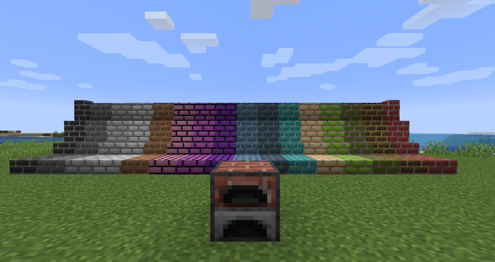
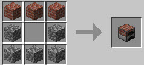
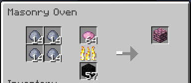
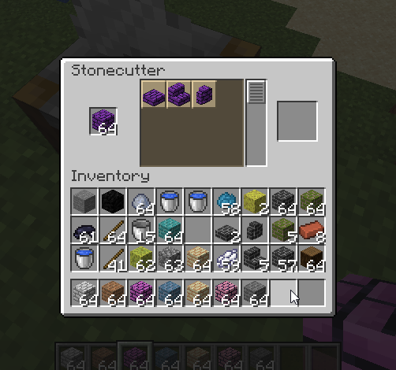
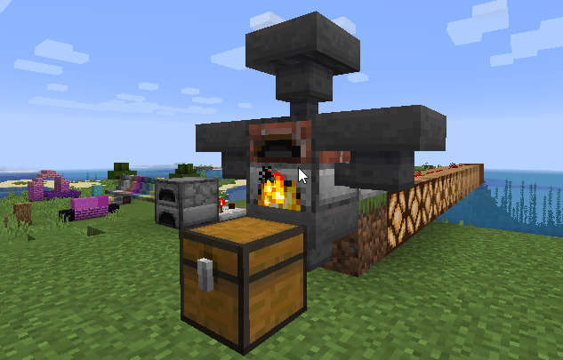

# Colorful Masonry

**Colorful Masonry** adds brick type blocks in all default dye colors.

They can be created using the newly added **Masonry Oven**.

#### Crafting recipe

#### Smelting with the Masonry Oven

- Add Clay and dye to the Masonry Oven to create bricks in any color.

#### Use the **stonecutter** to create slabs, stairs and brick walls.

#### The Masonry Oven also works with hoppers and redstone comparators

## License

Colorful Masonry is licensed under the Apache License 2.0.

